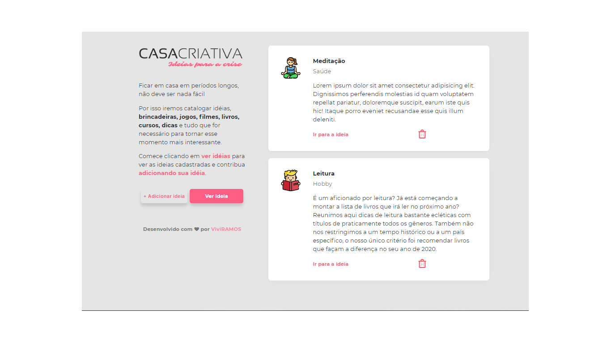
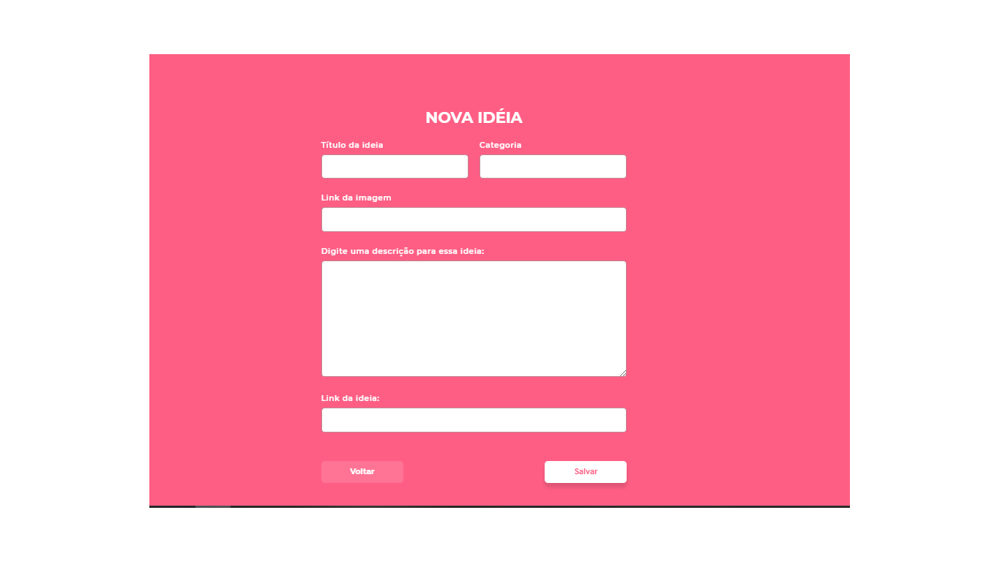
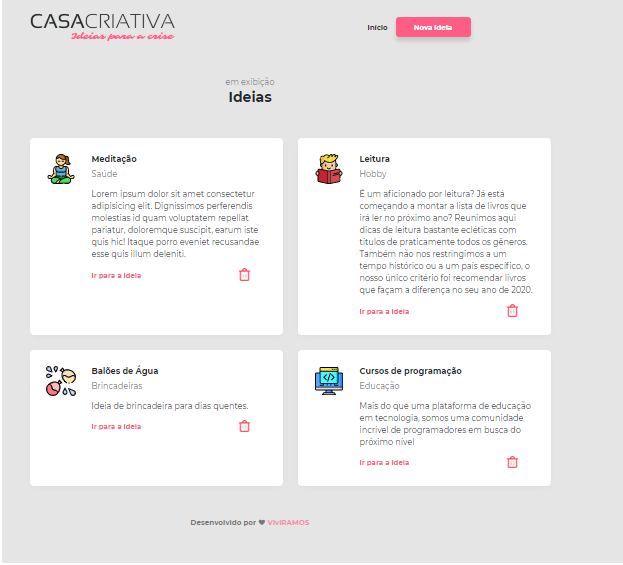

# WorkshopDev
Projeto CasaCriativa desenvolvido durante o workshopdev da rocketseat, utilizando as tecnologias Node, Nunjucks(com páginas dinâmicas), Express, Sqlite e Nodemon. 

Install
-npm install

Usage
npm run dev

Porta
3000

